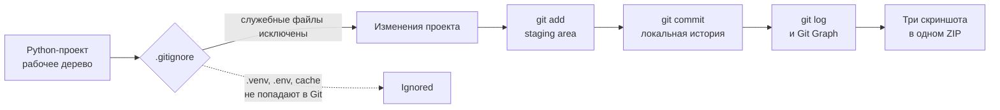

# Домашнее задание 📃

## Тема и результат

**Локальная работа с Git на собственном Python-проекте: коммиты, история и `.gitignore`.**

>[!info]
>
>### Что получится в результате
>
>Вы возьмёте любой свой Python-проект и организуете в нём локальный Git-репозиторий. В проекте появится `.gitignore`, который исключает виртуальное окружение и служебные файлы Python, а изменения будут сохранены несколькими осмысленными коммитами.
>
>Результат работы — понятная локальная история проекта, которую можно посмотреть в Git Graph и терминале. GitHub, удалённый репозиторий и публикация проекта в этой работе не нужны.

### Технологии

- Git
- локальный репозиторий
- коммиты и история изменений
- рабочее дерево и staging area
- `.gitignore`
- Git Graph в редакторе

## Сценарий работы

Работа выполняется на любом собственном Python-проекте. Это может быть проект с занятия №19 или другая работа, которую вы уже создали ранее. Важно, чтобы в папке проекта находилось виртуальное окружение `.venv` и чтобы сам проект можно было отличить от служебных файлов окружения.

Сначала вы инициализируете локальный репозиторий и создаёте `.gitignore`. Затем несколько раз изменяете проект, осознанно добавляете изменения в staging и сохраняете их отдельными коммитами. В конце проверяете локальную историю через Git Graph и терминал, а также подтверждаете, что `.venv` не отслеживается Git.

## Схема работы



## Задание

### Этап 1. Подготовить проект и `.gitignore`

Выберите любой собственный Python-проект и откройте терминал в его корневой папке. В проекте должна существовать папка виртуального окружения `.venv`.

Инициализируйте локальный репозиторий командой `git init` и создайте или проверьте файл `.gitignore`. Минимально он должен исключать:

```gitignore
.venv/
__pycache__/
*.pyc
```

Если проект использует `.env`, этот файл также должен быть исключён из Git:

```gitignore
.env
```

Сам файл `.gitignore` должен остаться частью проекта и быть виден на третьем скриншоте.

### Этап 2. Создать локальную историю

Сделайте не менее **трёх осмысленных коммитов**, отражающих этапы работы над проектом. Не требуется создавать отдельный коммит для каждого файла: важно, чтобы сообщения коммитов объясняли, что изменилось.

Пример последовательности:

```text
init: add project structure
feat: update application logic
docs: add run instructions
```

Названия коммитов могут быть своими. После изменений используйте рабочий цикл Git:

```text
изменить файл → проверить status/diff → выполнить git add → создать git commit
```

### Этап 3. Проверить локальный результат

Подготовьте три скриншота для сдачи:

| № | Что показать | Что должно быть видно |
|---:|---|---|
| **1** | Терминал с результатами команд Git | Локальный `git status`, история через `git log` и подтверждение, что `.venv` игнорируется |
| **2** | Плагин Git Graph | Локальная история проекта с несколькими осмысленными коммитами |
| **3** | Структура проекта | Папка `.venv` и файл `.gitignore` внутри папки проекта |

Для первого скриншота используйте команды, которые показывают результат локальной работы. Например:

```bash
git status
git log --oneline --graph --decorate --all
git check-ignore -v .venv/
```

Можно использовать эквивалентные команды Git, если на скриншоте однозначно видны чистое состояние репозитория, история коммитов и факт игнорирования `.venv`.

## Свобода реализации

Вы самостоятельно выбираете проект, содержание изменений, имена коммитов, количество файлов и способ выполнения команд. Допустимо работать через терминал, VS Code или другой интерфейс, но итоговая локальная история должна быть создана Git и открываться в Git Graph.

Скриншоты можно сделать в любом читаемом формате и оформить любым способом. Важно, чтобы на них были различимы нужные команды, результаты и элементы структуры проекта.

## Что нужно сдать

Соберите **один ZIP-архив с тремя скриншотами**:

| Материал | Обязательно | Что подтверждает |
|---|---:|---|
| Скриншот 1: терминал | Да | Локальный статус, история и проверка `.gitignore` |
| Скриншот 2: Git Graph | Да | Граф локальных коммитов |
| Скриншот 3: структура проекта | Да | Наличие `.venv` и `.gitignore` в проекте |

Имена ZIP-архива и изображений свободны. Исходный код проекта, папку `.git`, папку `.venv` и другие файлы проекта отдельно прикладывать не нужно.

>[!warning]
>
>### Перед упаковкой
>
>Не добавляйте в архив исходники, папку `.git`, папку `.venv`, токены, пароли, настоящий `.env` и другие секреты. В архив должны попасть только три скриншота.

## Самопроверка перед сдачей

- [ ] Работа выполнена на Python-проекте, а не в отдельной пустой папке.
- [ ] В папке проекта видны `.venv` и `.gitignore`.
- [ ] В `.gitignore` исключена папка `.venv`.
- [ ] Создано не менее трёх осмысленных локальных коммитов.
- [ ] Git Graph показывает историю этого проекта.
- [ ] На скриншоте терминала видны результаты локальных Git-команд.
- [ ] На скриншоте терминала подтверждено, что `.venv` игнорируется.
- [ ] В ZIP ровно три скриншота.
- [ ] В ZIP нет исходников, `.git`, `.venv`, секретов и дополнительных файлов.

## Обязательный контракт

### Проверяемые требования

| ID | Обязательный результат | Как проверить |
|---|---|---|
| `REQ-01` | В выбранном Python-проекте создан локальный Git-репозиторий с не менее чем тремя осмысленными коммитами | Скриншоты терминала и Git Graph |
| `REQ-02` | Файл `.gitignore` содержит исключение `.venv/`, а папка `.venv` действительно игнорируется Git | Скриншот терминала и скриншот структуры проекта |
| `REQ-03` | Терминал показывает локальное состояние репозитория, историю коммитов и проверку игнорирования `.venv` | Скриншот 1 |
| `REQ-04` | Git Graph показывает историю коммитов того же локального проекта | Скриншот 2 |
| `REQ-05` | В структуре проекта одновременно видны папка `.venv` и файл `.gitignore` | Скриншот 3 |
| `REQ-06` | Материалы сданы одним ZIP-архивом, содержащим ровно три скриншота | Содержимое ZIP-архива |

## Что не требуется и не оценивается

- GitHub и любой другой удалённый репозиторий.
- Команды `push`, `pull`, `fetch`, `clone`.
- Ветки, `merge`, Pull Request и работа в команде.
- `revert`, `force push` и публикация истории.
- Сбор всех предыдущих домашних заданий в проект.
- Конкретная тема Python-проекта, его интерфейс и дополнительные функции.
- Точное оформление Git Graph, цвета, расположение панелей и названия скриншотов.
- Точное количество коммитов сверх минимального требования.

## Фокус проверки

Проверяется именно локальный рабочий цикл Git: наличие истории из осмысленных коммитов, просмотр этой истории и корректное исключение виртуального окружения через `.gitignore`. Скриншоты должны подтверждать один и тот же проект и позволять увидеть терминальную проверку, Git Graph и структуру папки. Названия проекта, тексты коммитов, цветовая схема плагина и внутреннее содержание Python-кода не оцениваются, если локальный результат и обязательные доказательства сохранены.

## Критерии проверки 👌

| Категория | Полное выполнение | Частичное выполнение | Баллы |
|---|---|---|---:|
| Локальная история Git | Есть локальный репозиторий и не менее трёх осмысленных коммитов; история соответствует проекту (`REQ-01`) | Репозиторий или история показаны частично, коммитов меньше трёх либо их смысл неразличим | 5 |
| Работа с `.gitignore` | `.gitignore` виден в проекте, содержит `.venv/`, а терминал подтверждает игнорирование папки (`REQ-02`, `REQ-05`) | `.gitignore` есть, но исключение или наличие `.venv` подтверждены не полностью | 3 |
| Доказательства локальной работы | Терминал показывает `status`, историю и проверку `.venv`; Git Graph показывает ту же историю (`REQ-03`, `REQ-04`) | Один из видов доказательств отсутствует или читается частично | 2 |
| Формат сдачи | Один ZIP содержит ровно три читаемых скриншота, соответствующих заданию (`REQ-06`) | Скриншоты есть, но их количество, читаемость или упаковка не полностью соответствуют контракту | 2 |
| **Итого** |  |  | **12** |
